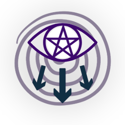

# Projeto Eyegore

Uma Engine de Raycasting 2D/3D Retrô Escrita em Rust

---

## Sobre

O Project Eyegore é um motor de jogo (game engine) de raycasting 2D/3D leve e de inspiração retrô desenvolvido em Rust.
Criado com muito trabalho duro e ~~minhas próprias lágrimas~~ paixão, ele projeta ambientes pseudo-3D dinâmicos a partir
de representações planas e simples em grades 2D — semelhante aos jogos de FPS clássicos dos anos 90, como *Wolfenstein
3D*.

## Recursos

- **Loop de Raycasting Rápido e Leve:**

- **Modularidade Compreensiva:**

- **Configuração Rápida:**

## Gratuito

O Projeto Eyegore é gratuito para uso sob a [licença MIT](LICENSE).

Você pode usá-lo da maneira que desejar.

## Obtendo a engine

### Binários de Release

As versões oficiais podem ser encontradas na [aba de releases](https://github.com/Herinhos/project_eyegore/releases)
onde você pode baixar a versão mais recente ou qualquer outra versão desejada da engine.

## Documentação (WIP)

A documentação oficial ainda é um **Trabalho Em Progresso** (WIP), *porém* o código-fonte ~~geralmente~~ é muito bem
comentado e conciso.

Por enquanto, você também pode perguntar diretamente ao autor original do código sobre o propósito dele.
~~*Respostas satisfatórias não são garantidas*~~

## Contribuindo

Se você tiver interesse neste projeto, ou tiver uma ideia fantástica de uma funcionalidade super legal e maluca para
adicionar, você é mais do que bem-vindo para fazer isso!
Basta dar uma olhada no [guia de contribuição](CONTRIBUTING.md) para conhecer as regras e não se perder no processo.

Para bugs e/ou problemas simples, sinta-se à vontade
para [abrir uma issue](https://github.com/Herinhos/project_eyegore/issues).

## Primeiros Passos

Basta baixar a versão mais recente, descompactá-la no diretório de sua preferência, configurar as opções do seu jogo no
arquivo `assets/CONFIG.ron`, definir suas texturas personalizadas e executar o `.exe`.

Abaixo está um guia passo a passo para você configurar seu primeiro jogo.

### !WIP!